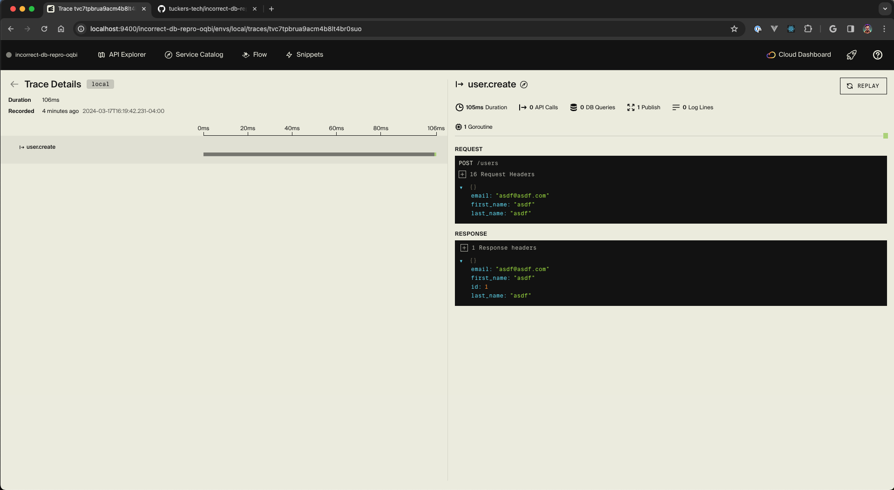
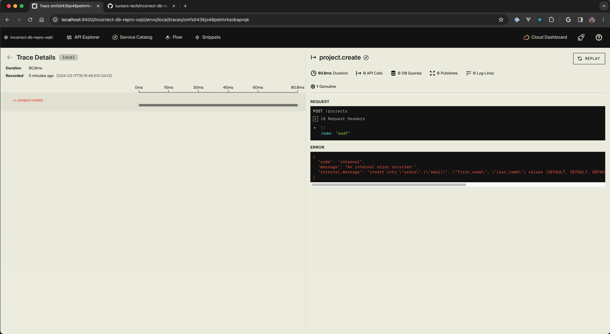

# Incorrect DB Reproduction

This is a smaller reproduction of an issue happening in a larger project. When I send a request to `user.create` everything works as expected. When a request is sent to the `project.create`, it appears that it is trying to create a user, even though it's referencing the [ProjectDB](https://github.com/tuckers-tech/incorrect-db-repro/blob/main/project/project.ts#L13).

Successful user create

Failed project create

